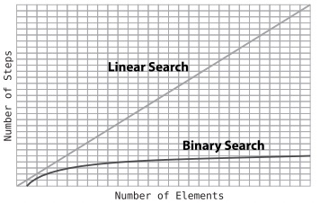

# Chapter 2

| Data Structure | Arrays | Sets    | Ordered Arrays |
|----------------|--------|---------|----------------|
| Reading        | O(1)   | O(1)    | O(1)           |
| Searching      | O(n)   | O(n)    | O(log n)       |
| Insertion      | O(n+1) | O(2n+1) | O(n+log n)     |
| Deletion       | O(n)   | O(n)    | O(n)           |

## Why Algorithms Matter
- An algorithm is simply a set of instructions for completing a specific task.

### Ordered Arrays
- The ordered array is almost identical to the “classic” array we saw in the previous chapter. The only difference is that ordered arrays require that the values are always kept—you guessed it—in order. That is, every time a value is added, it gets placed in the proper cell so that the values in the array remain sorted.
- In terms of N, we’d say that for N elements in an ordered array, the insertion took N + 2 steps in total.
- Interestingly, the number of steps for insertion remains similar no matter where in the ordered array our new value ends up.
- The fewest steps occur when the new value winds up at the very end, since no shifts are necessary. In this case, we take N steps to compare the new value with all N existing values, plus one step for the insertion itself, yielding a total of N + 1 steps.

#### Searching an Ordered Array
- At first glance, then, standard arrays and ordered arrays don’t have tremendous differences in efficiency, or at least not in worst-case scenarios. For both kinds of arrays, if they contain N elements, linear search can take up to N steps.
- But we’re about to unleash an algorithm that is so powerful that it will leave linear search in the dust.
- The big advantage of an ordered array over a classic array is that an ordered array allows for an alternative searching algorithm. This algorithm is known as binary search, and it is a much, much faster algorithm than linear search.

##### Binary Search
- Note that binary search is only possible within an ordered array.

##### Binary search vs. Linear Search
- each time we double the size of the ordered array, the number of steps needed for binary search increases by one. This makes sense, as each lookup eliminates half of the elements from the search.
- This pattern is unusually efficient: each time we double the data, the binary search algorithm adds just one more step.
  

- for linear search, each time we double the size of the array, we double the number of steps of our search. For binary search, though, each time we double the size of the array, we only need to add one more step.
