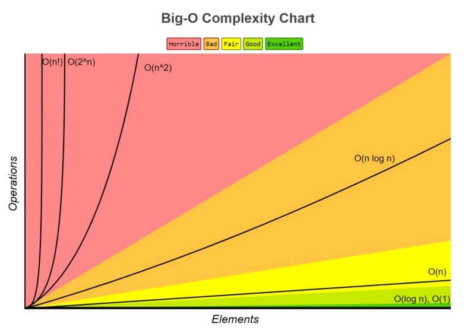

# Big Oh Notation

## Big O: How Many Steps Relative to N Elements?
- O(N) Some pronounce this as “Big Oh of N.” Others call it “Order of N.” My personal preference, however, is “Oh of N.”. It expresses the answer to what we’ll call the “key question.” The key question is: *_if there are N data elements, how many steps will the algorithm take?_*. an algorithm that is O(N) is also known as having linear time.
- O(1) is considered the “fastest” kind of algorithm. Even as the data increases, an O(1) algorithm doesn’t take any additional steps. The algorithm always takes a constant number of steps no matter what N is. In fact, O(1) algorithm can also be referred to as having constant time.
- O(log N) This type of algorithm is also known as having a time complexity of log time. O(log N) is the Big O way of describing an algorithm that increases one step each time the data is doubled.
- O(N2) is also referred to as quadratic time.
- 
### The Soul of Big O
- The soul of Big O is what Big O is truly concerned about: how will an algorithm’s performance change as the data increases?
- Big O doesn’t want to simply tell you how many steps an algorithm takes. It wants to tell you the story of how the number of steps increase as the data changes.
- Because there will always be some amount of data at which the tides turn, and O(N) takes more steps from that point until infinity, O(N) is considered to be, on the whole, less efficient than O(1) no matter how many steps the O(1) algorithm actually takes.
- Big O Notation generally refers to the worst-case scenario unless specified otherwise. This is why most references will describe linear search as being O(N) even though it can be O(1) in a best-case scenario.
- binary search as having a time complexity of O(log N)

## Complexity Chart  

## Additional Sources
- [FreeCodeCamp](https://www.freecodecamp.org/news/big-o-notation-why-it-matters-and-why-it-doesnt-1674cfa8a23c/)
