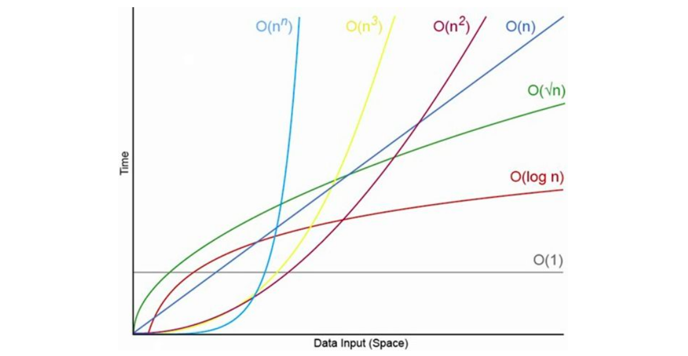

# Speeding up your code with or without Big Oh

## Selection Sort
- We check each cell of the array from left to right to determine which value is least. As we move from cell to cell, we keep track of the lowest value we’ve encountered so far.
- Once we’ve determined which index contains the lowest value, we swap its value with the value we began the pass-through with.
- *_Big O Notation ignores constants._* This is simply a mathematical way of saying that Big O Notation never includes regular numbers that aren’t an exponent. We simply drop these regular numbers from the expression. for example, even though the algorithm takes `N^2 / 2` steps, we drop the `/ 2` because it’s a regular number, and express the efficiency as `O(N^2)`.

### Big O Categories
- Big O Notation only concerns itself with general categories of algorithm speeds.
  
- when comparing two efficiencies that belong to two different categories of Big O, it’s enough to identify them by their general category.
- Multiplying or dividing the number of steps by a regular number doesn’t make them change to another category.
- However, when two algorithms fall under the same classification of Big O, it doesn’t necessarily mean that both algorithms have the same speed.
- while Big O is perfect for contrasting algorithms that fall under different classifications of Big O, when two algorithms fall under the same classification, further analysis is required to determine which algorithm is faster.

### Significant Steps
- How we should determine which steps are significant enough to be counted when expressing the Big O of an algorithm.
- The answer is that all steps are significant. It’s just that when we express the steps in Big O terms, we drop the constants and thereby simplify the expression.
  Let’s apply this here. If we count all the steps, we have N comparisons, N incrementing, and N / 2 printings. This adds up to 2.5N steps. However, because we eliminate the constant of 2.5, we express this as O(N). So, which step was significant? They all were, but by dropping the constant, we effectively focus more on the number of times the loop runs, rather than the exact details of what happens within the loop.
