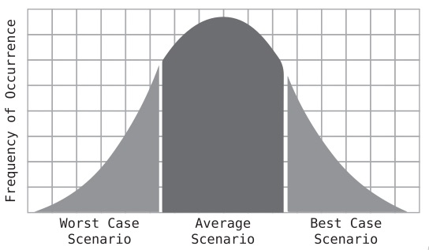
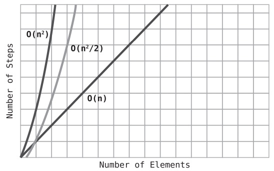

# Optimizing for Optimistic Scenarios
- Being able to consider all scenarios is an important skill that can help you choose the appropriate algorithm for every situation.

### The Efficiency of Insertion Sort
- Big O Notation only takes into account the highest order of N when we have multiple orders added together.

### The Average Case
- the cases that occur most frequently are average scenarios. Take a look at this simple bell curve:

 
- Best- and worst-case scenarios happen relatively infrequently. In the real world, average scenarios are what occur most of the time.
- For the average scenario, we can say that in the aggregate, we probably compare and shift about half the data. Thus, if Insertion Sort takes N2 steps for the worst-case scenario, we’d say that it takes about `N^2 / 2` steps for the average scenario. (In terms of Big O, however, both scenarios are `O(N^2)`.)
- In the worst-case scenario, Insertion Sort takes `N^2` steps. In an average scenario, it takes `N^2 / 2` steps. And in the best-case scenario, it takes about N steps.

 

- Selection Sort takes `N^2 / 2` steps in all cases, from worst to average to best-case scenarios. This is because Selection Sort doesn’t have any mechanism for ending a pass-through early at any point. Each pass-through compares every value to the right of the chosen index no matter what.
- If you have reason to assume you’ll be dealing with data that is mostly sorted, Insertion Sort will be a better choice. If you have reason to assume you’ll be dealing with data that is mostly sorted in reverse order, Selection Sort will be faster. If you have no idea what the data will be like, that’s essentially an average case, and both will be equal.
- If the arrays are different sizes—say N and M—we’d say that the efficiency of this function is `O(N * M)`.
## How
- Insertion sort was introduced
- Speeds:
  - All `O(N^2)`
  - Sorted
    - Bubble sort - fastest - `N` steps
    - Selection sort - slowest - `N^2 / 2` steps
    - Insertion sort - middle - `2N` steps
  - Reversed
    - Bubble sort - slowest - `N^2` steps
    - Selection Sort - fastest - `N^2 / 2` steps
    - Insertion sort - middle - `N^2 / 2` steps
  - Randomized
    - Bubble sort - slowest - `N^2` steps
    - Selection Sort - middle - `N^2 / 2` steps
    - Insertion sort - fastest - `N^2 / 4` steps (variable)
- Insertion sort works best on average for best-case and average-case scenarios
- Optimization should be done in regard to which case do we want to cover
- Most likely, we want to cover average-case scenario
