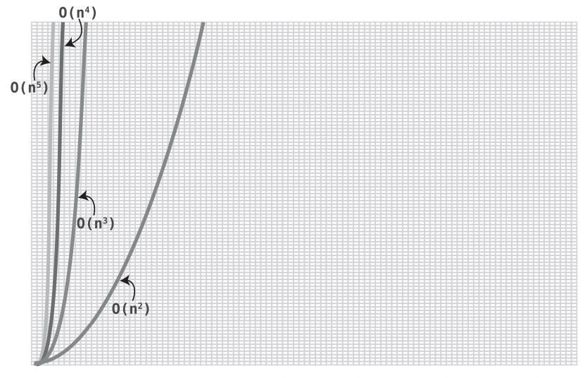
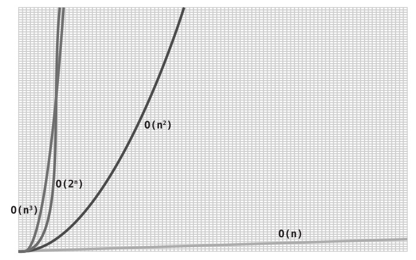

# Big Oh In everyday Code

- This is a new concept: whenever we have two distinct datasets that have to interact with each other through multiplication, we have to identify both sources separately when we describe the efficiency in terms of Big O.
- While this is the correct way of expressing this algorithm in terms of Big O Notation, it’s a little less useful than other expressions of Big O. Comparing an `O(N * M)` algorithm to algorithms that only have an N (and not an M) is a little like comparing apples to oranges.
- However, we do know that there’s a specific range in which `O(N * M)` lies. That is, if N and M are the same, it’s equivalent to `O(N^2)`. And if they’re not the same, and we arbitrarily assign the smaller number to be M, even if M is as low as 1, we end up with `O(N)`. In a sense then, `O(N * M)` can be construed as a range between `O(N)` and `O(N^2)`.
- In a certain sense, O(2N) is the opposite of O(log N). With an algorithm of O(log N) (like binary search), each time the data is doubled, the algorithm takes one additional step. With an algorithm of O(2N), each time we add one element of data, the algorithm doubles in steps!

## Summary
- Chapter deals with a couple simple algorithms and explains the efficiency of such code and why is it so
- Keep in mind that the simple algorithms could have been made better, but contents purposely show worse
- Show differences between Big Oh and actual runtime
- Big Oh is very valuable! However, the real run can actually be slower/faster, as Big Oh ignores constants
  - 6N operations is `O(N) `
  - 6N^2 operations is `O(N^2)`
  - M + N operations is `O(N)`
  - M + 4N is `O(N)`
