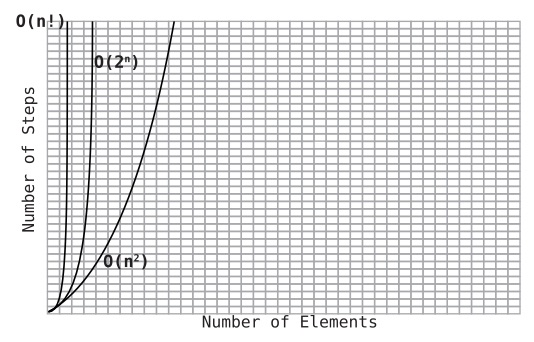

# Learning to Write in Recursive
## Recursive Category: Repeatedly Execute
- in-place modification, meaning the function actually changes the original array passed into function.

## Recursive Category: Calculations
- we found that one area in which
  recursion shines is where we need to act on a problem that has an arbitrary number of levels of depth. A second area in which recursion shines is where it is able to make a calculation based on a subproblem of the problem at hand.
- A subproblem is a version of the very same problem applied to a smaller input. Let’s apply this to our case.
- We’ve seen that when writing a function that makes a calculation, there are two potential approaches: we can try to build the solution from the “bottom up,” or we can attack the problem going “top down” by making the calculation based on the problem’s subproblem. Indeed, computer science literature refers to the terms bottom up and top down in regard to recursion strategies.
- While we previously saw the bottom-up approach using a classic loop, we can also use recursion to implement the bottom-up strategy.
- And because recursion is the only way to achieve a top-down strategy, it’s one of the key factors that makes recursion a powerful tool.
- recursion shines when implementing a top-down approach because going top down offers a new mental strategy for tackling a problem.
  1. Imagine the function you’re writing has already been implemented by someone else.
  2. Identify the subproblem of the problem.
  3. See what happens when you call the function on the subproblem and go from there.
- First, let’s identify the subproblem. Again, this takes practice, but very often the first thing to try is the next-to-smallest version of the problem at hand.
### Anagram Generation
- For a string of length N, we produce N! anagrams. In Big O Notation then, this is expressed as O(N!). This is also known as factorial time. 
- O(N!) is the slowest category of Big O we’ll encounter in this book.

