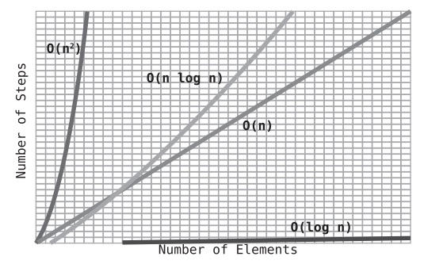

# Recursive algorithms for speed
- Quicksort is an extremely fast sorting algorithm that is particularly efficient for average scenarios. While in worst-case scenarios (that is, inversely sorted arrays), it performs similarly to Insertion Sort and Selection Sort, it is much faster for average scenarios—which are what occur most of the time.
## Partitioning
- To partition an array is to take a random value from the array—which is then called the pivot—and make sure that every number that is less than the pivot ends up to the left of the pivot, and that every number greater than the pivot ends up to the right of the pivot.
### Quicksort
- The Quicksort algorithm is a combination of partitions and recursion. It works as follows:
  1. Partition the array. The pivot is now in its proper place.
  2. Treat the subarrays to the left and right of the pivot as their own arrays, and recursively repeat Steps 1 and 2. That means we’ll partition each subarray and end up with even smaller sub-subarrays to the left and right of each subarray’s pivot. We then partition those sub-subarrays, and so on and so forth.
  3. When we have a subarray that has zero or one elements, that is our base case and we do nothing.

#### The Big O of Quicksort
- If we look at the pattern shown earlier, we’ll note that the number of Quicksort steps for N elements in the array is about N multiplied by log N, as shown in the following table:

| N   | Log N | N * Log N | Quicksort Steps (approx.) |
|-----|-------|-----------|---------------------------|
| 4   | 2     | 8         | 8                         |
| 8   | 3     | 24        | 24                        |
| 16  | 4     | 64        | 64                        |
| 32  | 5     | 160       | 160                       |

- In fact, this is exactly how to express the efficiency of Quicksort. It’s an algorithm of O(N log N). We’ve discovered a new category of Big O!

- Each time we partition the array, we end up breaking it down into two subarrays. Assuming the pivot ends up somewhere in the middle of the array—which is what happens in the average case—these two subarrays are of roughly equal sizes.
- How many times can we break an array into halves until we’ve broken it completely down to the point of where each subarray is of size 1? For an array of size N, this will take us log N times. Take a look at the following diagram
- this is why Quicksort takes N * log N steps. We have log N halvings, and for each halving, we perform a partition on all the subarrays whose elements add up to N. (They add up to N because all the subarrays are simply pieces of the original array of N elements.)
- Bear in mind that O(N * log N) is just an approximation. In reality, we first perform an extra O(N) partition on the original array as well. Additionally, an array doesn’t cleanly break into two even halves, since the pivot is not part of the “halving.”

#### Quicksort in the Worst-Case Scenario
- the best-case scenario is one in which the pivot always ends up smack in the middle of the subarray after the partition. Interestingly, this generally occurs when the values in the array are mixed up pretty well.
- The worst-case scenario for Quicksort is one in which the pivot always ends up on one side of the subarray instead of in the middle. This can happen where the array is in perfect ascending or descending order.
- in a worst-case scenario, Quicksort has an efficiency of O(N2).

### Quickselect
- Let’s say you have an array in random order, and you do not need to sort it, but you do want to know the tenth-lowest value in the array, or the fifth-highest.
- Like Quicksort, Quickselect relies on partitioning, and can be thought of as a hybrid of Quicksort and binary search.
- One of the beautiful things about Quickselect is that we can find the correct value without having to sort the entire array.
- Another way to formulate this is to say that for N elements, we would need N + (N/2) + (N/4) + (N/8) + ... 2 steps. This always turns out to be roughly 2N steps.
- Since Big O ignores constants, we drop the 2 from the 2N and say that Quickselect has an efficiency of O(N).
- there are many others as well. Mergesort is another well-known O(N log N) sorting algorithm, and I recommend you look it up, as it is a beautiful recursive algorithm. 
- The fact that the fastest sorting algorithms are O(N log N) is quite important, as this has implications for other algorithms as well. This is because there are algorithms that use sorting as a component of a larger process.
- You learned that when we have multiple orders added together, Big O Notation keeps only the highest order of N, because the lower orders are trivial beside the higher orders. Here as well, N is trivial beside N log N, so we reduce the expression to O(N log N).
- Plenty of algorithms employ sorting as part of a larger process. We now know that any time we do so, we have an algorithm that is at least O(N log N). Of course, the algorithm may be slower than this if it has other things going on, but we know that O(N log N) will always be the baseline.
